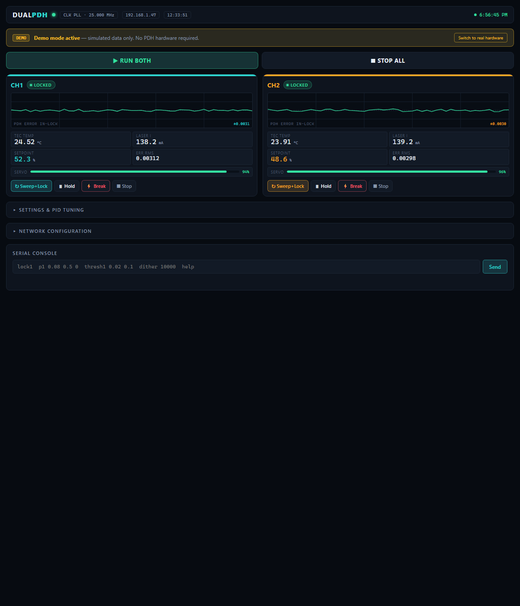

# Dual-Laser PDH Driver

**A precision two-channel controller for 1550 nm DFB butterfly lasers — a differential optical thermometer built as a 3U Eurocard instrument.**

Each channel provides low-noise constant-current laser drive, a bipolar linear TEC temperature controller, RF frequency modulation, and a synchronous-demodulation Pound–Drever–Hall lock that holds the laser to the side of an optical resonance. Lasers A and B lock to their own fringe of a shared reference cavity; the beat frequency between them, Δν = S·(T_B − T_A) with S ≈ 2 GHz/K, is a ratiometric measurement in which slow common-mode drift cancels.

## Highlights

| | |
|---|---|
| **2×** | 1550 nm DFB laser channels |
| **≈2 GHz/K** | beat sensitivity |
| **4–40 nK** | 60 s stability (equivalent-kelvin Allan deviation) |
| **±2.5 A** | bipolar linear TEC per channel |
| **8-slot** | 3U passive backplane, card-based architecture |

The RF analog-derivative lock this hardware runs targets the ≈4–11 nK regime, limited primarily by the laser's residual amplitude modulation (RAM), not by the electronics.

## ⚠️ Safety

This is a mains-powered Class 3B/4 laser instrument. Before working on it, read [Section 02 of the User Manual](docs/laser_driver_v5_user_manual.html). In brief:

- **Mains voltage** — the AC board and toroidal transformers carry 120 VAC. Only qualified personnel should open the enclosure with power applied; do not defeat the IEC inlet fuse or SL22 inrush thermistor.
- **Invisible 1550 nm laser radiation** — can damage the retina. Never look into a fiber connector or butterfly output; cap unused fibers; follow your site's laser-safety procedures.
- **Laser reverse voltage** — the DFB die tolerates only ≈2 V reverse. The per-channel BAT46W Schottky clamp is mandatory; confirm polarity before first power-on.
- **Live heatsinks** — on the pm22V and pm6V supplies the pass-transistor tabs sit at the raw rail (up to ≈±28 V), not ground. Isolate or keep them clear.

## Architecture

The instrument is a set of interchangeable cards on a passive 3U backplane, each in a universal slot with on-card jumper addressing:

- **AC Board** — mains entry, IEC inlet, transformers
- **pm22V / pm6V / pm1p8V** — linear power supplies (±18 V, ±6 V TEC, low-voltage rails)
- **DIG card** — Teensy-based controller, web dashboard, fault handling
- **CH card ×2** — per-channel laser constant-current drive + bipolar TEC
- **AFE card** — analog detection / synchronous-demodulation front end

## Documentation

| Document | Contents |
|---|---|
| **[User Manual (v5)](docs/laser_driver_v5_user_manual.html)** | Full theory of operation, per-card reference, software, bring-up, uncertainty budget |
| [Firmware reference](docs/firmware_reference.html) | Teensy firmware, command set, lock state machine |
| [Power review](docs/laser_driver_v5_power_review.html) | Supply analysis |
| [Project summary](Dual-Laser_PDH_Driver_Summary.pdf) | One-document overview (PDF) |

> The HTML docs are styled pages — they render best via GitHub Pages or by opening the file locally. On GitHub the raw source is shown when clicked.

## Repository layout

This repository spans several design generations. **`Lasser_Driver_v5/` is the current, card-based design** that the User Manual describes. `Laser_Driver_v3/` and `Laser_Driver_v4/` are earlier monolithic/mains prototypes retained for reference. Firmware lives in `Teensy/`, and all documentation is in `docs/`.

## License

Copyright © 2026 Stefan Cular. All rights reserved. See [LICENSE](LICENSE).
This project is published for reference and viewing only; no reuse is permitted without written permission.
